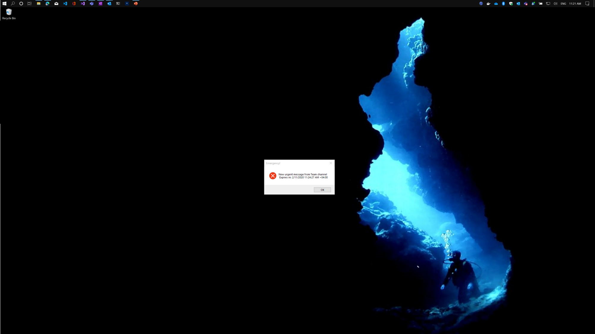

# Emergency Notifications Systems for Teams

## Problem Statment
Notifying the users in case of an emergency with a clear blocking message using Teams.

Teams notifications are non-blocking and will be visible on Teams application if the Teams window is active or Windows/ Windows Notification Center in case of Teams window is not active.

In case the end user has Windows 10 Focus Assist ([link](https://support.microsoft.com/en-us/help/4026996/windows-10-turn-focus-assist-on-or-off)) active (manually, presentation mode or others) the notification will not be visible to the user and will be added to the notification center

## Proposed Solution/ Flow
- Emergency agent or admin will send a normal message over a dedicated team channel
- Using Power Automate/ Azure Logic App, the message being pushed to a table with the required information (message content and expiry in minutes)
- A windows agent tray application (running on Windows machines) will pick any new message and alert the user through normal windows alert message box. A blocking message box in the center of the screen that must be dismissed by the customer.
- The Windows Application can be pushed to the end users using Configuration Manager.

### Limitations 
- Only Windows clients 
- MacOS and mobile Apps are supported in this solution
- Teams APIs/Connector has a throttling limit https://docs.microsoft.com/en-us/connectors/teams/#limits

### Detailed Flow
#### Step 1: Sending the message
- Sending a normal Teams message to a dedicated emergency channel

#### Step 2: Automation workflow (Power Automate/ Azure Logic App)
- Listen to the message in a specific team and specific Channel

- Once received, push the message to intermediate storage with the details (Azure Table)

- Each message will have a default expiry time of 30 minutes and active flag (true/false)
#### Step 3: Windows Notifications
- Notification Agent (Windows Tray Application) will check for new messages.

- Upon receiving a new message, display a clear blocking Windows Alert Message

- The message will be repeated every 3 seconds until the expiry time passed.

